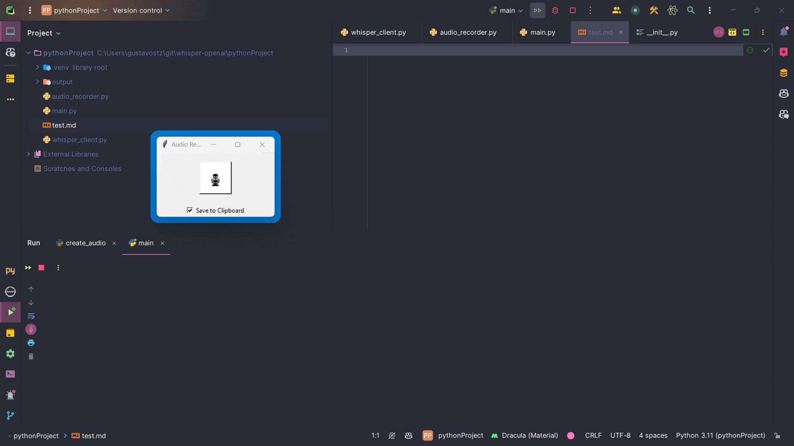

# WhisperClip: One-Click Audio Transcription



WhisperClip simplifies your life by automatically transcribing audio recordings and saving the text directly to your clipboard. With just a click of a button, you can effortlessly convert spoken words into written text, ready to be pasted wherever you need it. Powered by OpenAI's Whisper model via [faster-whisper](https://github.com/SYSTRAN/faster-whisper), it provides fast, free, and fully local transcription — your audio never leaves your machine.

## Table of Contents

- [Features](#features)
- [Installation](#installation)
  - [Prerequisites](#prerequisites)
  - [Setting Up the Environment](#setting-up-the-environment)
  - [Choosing the Right Model](#choosing-the-right-model)
- [Usage](#usage)
- [Configuration](#configuration)
- [Mobile Remote Transcription](#mobile-remote-transcription)
  - [Server Setup](#server-setup)
  - [Network Setup](#network-setup)
  - [iOS Shortcut Setup](#ios-shortcut-setup)
  - [Android Setup](#android-setup)
  - [Quick Access Tips](#quick-access-tips)
- [Feedback](#feedback)
- [Acknowledgments](#acknowledgments)

## Features

- Record audio with a simple click or global hotkey (`Alt+Shift+R`).
- Fast, local transcription using OpenAI's Whisper model with GPU acceleration (CUDA).
- Option to save transcriptions directly to the clipboard.
- Transcribe existing audio files via the file picker.
- Optional LLM context prefix — prepends a note explaining the text was generated via speech-to-text.
- Real-time audio visualizer showing recording and transcription states.
- **Remote transcription API** — transcribe audio from your phone using your PC's GPU via an iOS Shortcut or Android app.

## Installation

### Prerequisites

- Python 3.10 or higher
- [CUDA](https://developer.nvidia.com/cuda-downloads) is highly recommended for better performance but not necessary. WhisperClip can also run on a CPU.

### Setting Up the Environment

1. Clone the repository:
   ```
   git clone https://github.com/gustavostz/whisper-clip.git
   cd whisper-clip
   ```

2. Create and activate a virtual environment:
   ```
   python -m venv .venv
   .venv\Scripts\activate        # Windows
   source .venv/bin/activate     # Linux/macOS
   ```

3. Install the required dependencies:
   ```
   pip install -r requirements.txt
   ```

### Choosing the Right Model

The default model is `turbo` (large-v3-turbo), which offers the best balance of speed and accuracy at ~1.5 GB VRAM with int8 quantization. Available models:

|  Size  | Required VRAM (int8) | Relative speed |
|:------:|:--------------------:|:--------------:|
|  tiny  |       ~0.5 GB        |    fastest     |
|  base  |       ~0.5 GB        |      fast      |
| small  |       ~1 GB          |    moderate    |
| medium |       ~2.5 GB        |     slower     |
| large-v3 |     ~3 GB          |    slowest     |
| turbo  |       ~1.5 GB        |  fast + accurate (recommended) |

To change the model, modify `model_name` in `config.json`. You can also change `compute_type` (default: `int8`) — options include `float16`, `int8_float16`, `int8`.

## Usage

Run the application:

```
python main.py
```

- Click the microphone button to start and stop recording.
- If "Save to Clipboard" is checked, the transcription will be copied to your clipboard automatically.

## Configuration

Copy `config.example.json` to `config.json` and edit as needed:

```
cp config.example.json config.json
```

| Setting | Default | Description |
|---------|---------|-------------|
| `model_name` | `"turbo"` | Whisper model to use (see table above) |
| `compute_type` | `"int8"` | Quantization type (`int8`, `float16`, `int8_float16`) |
| `shortcut` | `"alt+shift+r"` | Global hotkey for toggling recording |
| `notify_clipboard_saving` | `true` | Play a sound when transcription is copied to clipboard |
| `llm_context_prefix` | `true` | Prepend a note to transcriptions explaining they were generated via speech-to-text |
| `server_enabled` | `false` | Enable the remote transcription API server |
| `server_port` | `8787` | Port for the API server |
| `server_api_key` | `""` | API key for authenticating remote requests (required if server is enabled) |

## Mobile Remote Transcription

WhisperClip includes a built-in API server that lets you transcribe audio from your phone using your PC's GPU. Record on your iPhone or Android device, send the audio to your PC over a VPN, and get the transcription back in seconds — copied straight to your phone's clipboard.

### Server Setup

1. Generate a secure API key:
   ```
   python -c "import secrets; print(secrets.token_urlsafe(32))"
   ```

2. Install the server dependencies (if not already installed):
   ```
   pip install fastapi uvicorn[standard] python-multipart
   ```

3. Edit your `config.json`:
   ```json
   {
     "server_enabled": true,
     "server_port": 8787,
     "server_api_key": "YOUR_GENERATED_KEY_HERE"
   }
   ```

4. Start WhisperClip normally — the API server starts automatically alongside the desktop app:
   ```
   python main.py
   ```

5. Verify the server is running by opening this URL in your PC's browser:
   ```
   http://localhost:8787/api/v1/health
   ```
   You should see: `{"status":"ok","model":"turbo","compute_type":"int8"}`

### Network Setup

Your phone needs to reach your PC over the network. Since they won't always be on the same Wi-Fi, a mesh VPN is the easiest solution. Below are two popular options, but any VPN or tunneling tool that gives your devices a stable IP will work.

#### Option A: Tailscale (Free)

[Tailscale](https://tailscale.com/) creates a peer-to-peer mesh network between your devices. No port forwarding needed.

1. Install Tailscale on your PC and phone (available on Windows, iOS, Android).
2. Sign in with the same account on both devices.
3. Note your PC's Tailscale IP (shown in the Tailscale app, e.g. `100.x.y.z`).
4. Test from your phone's browser: `http://<TAILSCALE_IP>:8787/api/v1/health`

> **Note:** If you use another VPN (e.g. NordVPN, ExpressVPN) alongside Tailscale, the two may conflict since both manage routing. Consider using only Tailscale, or use a mesh VPN solution from your existing VPN provider (see Option B).

#### Option B: NordVPN Meshnet (or Other VPN Mesh)

If you already use NordVPN, you can use its [Meshnet](https://meshnet.nordvpn.com/) feature instead of Tailscale. Many VPN providers offer similar mesh/LAN features.

1. Enable Meshnet in NordVPN on both your PC and phone.
2. Link your devices in the Meshnet settings.
3. Note your PC's Meshnet IP (e.g. `100.x.y.z`) — shown in the NordVPN Meshnet panel.
4. Test from your phone's browser: `http://<MESHNET_IP>:8787/api/v1/health`

This avoids conflicts with your existing VPN connection since Meshnet runs alongside NordVPN.

### iOS Shortcut Setup

Create an iOS Shortcut that records audio, sends it to your PC for transcription, and copies the result to your clipboard.

1. Open the **Shortcuts** app on your iPhone.
2. Tap **+** to create a new shortcut.
3. Add the following actions in order:

**Action 1 — Record Audio:**
- Search for **"Record Audio"** and add it.
- Set audio quality to **Normal** (or Very High if you prefer).
- Disable **"Begin recording immediately"** if you want a countdown, or enable it for instant recording.

**Action 2 — Get Contents of URL:**
- Search for **"Get Contents of URL"** and add it.
- Set the URL to:
  ```
  http://<YOUR_PC_IP>:8787/api/v1/transcribe?llm_context_prefix=false
  ```
  Replace `<YOUR_PC_IP>` with your Tailscale/Meshnet IP.
- Set Method to **POST**.
- Under **Headers**, add:
  - Key: `X-API-Key`
  - Value: your API key from `config.json`
- Under **Request Body**, select **Form**.
- Add a field:
  - Key: `file`
  - Type: **File**
  - Value: select **"Recorded Audio"** (the output from Action 1)

**Action 3 — Get Dictionary Value:**
- Search for **"Get Dictionary Value"** and add it.
- Set it to get the value for key **`text`** from **"Contents of URL"**.

**Action 4 — Copy to Clipboard:**
- Search for **"Copy to Clipboard"** and add it.
- It will automatically use the dictionary value from Action 3.

**Action 5 (Optional) — Show Notification:**
- Search for **"Show Notification"** and add it.
- Set the body to **"Dictionary Value"** to see the transcription result.

4. Tap the shortcut name at the top to rename it (e.g. "Transcribe").
5. Tap **Done**.

To test: run the shortcut, speak a few words, tap stop, and wait for the transcription. It should appear in your clipboard (and in the notification if you added Action 5).

> **Tip:** Set `llm_context_prefix=true` in the URL if you want the transcription prefixed with a note that it was generated via speech-to-text — useful when pasting into LLM chats.

### Android Setup

Android doesn't have a built-in equivalent to iOS Shortcuts, but you can achieve the same result with automation apps:

- **[Tasker](https://play.google.com/store/apps/details?id=net.dinglisch.android.taskm)** — Create a task that records audio, sends an HTTP POST to the transcription endpoint, parses the JSON response, and copies the text to the clipboard. Tasker supports all the required actions (audio recording, HTTP requests, JSON parsing, clipboard).
- **[HTTP Shortcuts](https://play.google.com/store/apps/details?id=ch.rmy.android.http_shortcuts)** — A simpler app focused on making HTTP requests. You can set up a shortcut that sends an audio file to the API and displays the result.
- **[Automate](https://play.google.com/store/apps/details?id=com.llamalab.automate)** — Flow-based automation similar to iOS Shortcuts. Build a flow: Record Audio → HTTP Request → Parse JSON → Copy to Clipboard.

The API endpoint and parameters are the same as the iOS setup:
- **URL:** `http://<YOUR_PC_IP>:8787/api/v1/transcribe`
- **Method:** POST
- **Header:** `X-API-Key: <your_key>`
- **Body:** multipart form with `file` field containing the audio recording

### Quick Access Tips

To make transcription faster to trigger from your phone:

- **iPhone Action Button** (iPhone 15 Pro+): Settings → Action Button → set to Shortcut → select your transcription shortcut. Single press to start transcribing.
- **iPhone Back Tap**: Settings → Accessibility → Touch → Back Tap → set Double Tap or Triple Tap to your shortcut.
- **iPhone Lock Screen**: Add the Shortcuts widget to your lock screen for one-tap access.
- **iPhone Home Screen**: In the Shortcuts app, long-press your shortcut → Add to Home Screen.
- **Android**: Most automation apps support home screen widgets and quick settings tiles.

## Feedback

If there's interest in a more user-friendly, executable version of WhisperClip, I'd be happy to consider creating one. Your feedback and suggestions are welcome! Just let me know through the [GitHub issues](https://github.com/gustavostz/whisper-clip/issues).

## Acknowledgments

This project uses [faster-whisper](https://github.com/SYSTRAN/faster-whisper) (a CTranslate2-based reimplementation of OpenAI's [Whisper](https://github.com/openai/whisper)) for audio transcription.
